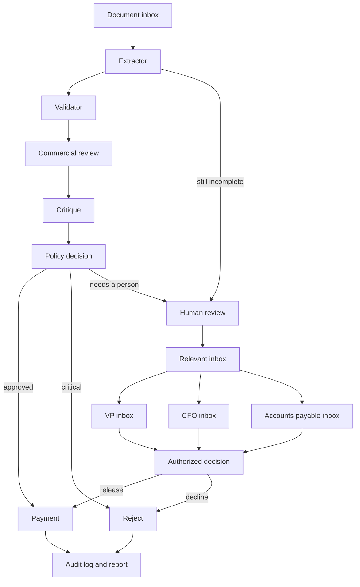

# Acme Invoice Control

Acme, a PE-backed manufacturer, loses about $2 million a year because invoice handling is manual. Documents arrive in messy formats. Staff retypes them, checks a legacy inventory file, chases VP approval through email, and then pays. About 30% of that work is wrong, and a typical invoice takes five days.

This system replaces that path with a local multi-agent control. LangGraph routes each invoice. Grok reads the document and answers the commercial questions. Python checks the master data and makes the payment decision. A person still owns the cases that need judgment, and those cases are meant to land in that person's inbox.

## System design

Four agents share one invoice state. The route between them is code. The model does not choose the next agent, and it cannot approve a critical control failure.

| Agent | Role |
|---|---|
| Extractor | Reads txt, JSON, CSV, XML, or PDF into one invoice. Retries once when required fields or the arithmetic are incomplete. |
| Validator | Matches vendor, item, stock, and unit price in the relational masters. Quantities for the same item are summed first. |
| Approver | Grok judges the commercial questions, a second call critiques that answer once, then `policy.py` applies the VP controls. |
| Payment | Calls `mock_payment` only after an approval. |

A hold is not a fifth agent. It is the point where the invoice leaves automation and goes to the person who can actually close it.

| Hold | Inbox |
|---|---|
| Price, rush premium, vendor questions, or an unresolved commercial concern | VP |
| Total over $10,000, a currency other than USD, or a wire, immediate, or advance payment | CFO |
| Required fields still missing, or document math that still does not tie | Accounts payable |

One invoice can sit in more than one inbox. The person who receives it authorizes release or rejection. Release is the only way a held invoice reaches payment. The local dashboard is the review desk for that queue. Delivery into a mail inbox is the operating design for the next step. It is not a separate coded agent in this repository.



Finalize writes `output/<invoice>.json`, a one-page HTML report, and a row in `output/audit.db`. The next invoice uses that log for duplicate and spend-pattern checks.

On a clean invoice the bars are concrete. Match on vendor, item, stock, and price, total at or under $10,000, and a complete commercial review: pay. Total over $5,000 and at or under $10,000 is a flag on the approval, not a block. Over $10,000, a unit price more than 5% from the master, rush plus a price gap, unusual payment terms, or a non-USD currency: hold, then the inbox above. Unknown vendor or item, quantity over stock, a negative amount, a duplicate invoice number, or a total over $25,000: reject, and do not pay.

## Requirements

These are the release bars. The prototype is built so each invoice produces a recorded decision. The error rate and the one-hour clock are checked in the audit log before any live expansion.

### Functional

1. **Error rate under 10%.** On the golden set, fewer than one in ten invoices is paid when it should have been held or rejected, rejected when it was clean, or held with no stated reason.
2. **Processing under one hour.** From receipt to a recorded outcome — paid, rejected, or sitting in the right inbox — the clock stays inside an hour, against the five days Acme spends today.
3. **Short automated latency.** Extraction, validation, and the policy decision finish in one pass, so the hour belongs to the person on a hold, not to the model call.

### Non-functional

1. **Transparency.** Stakeholders see the queue, the reason, and the agent trace on the live dashboard. The same facts are in the audit log, so a review does not depend on someone's memory of an email thread.
2. **Authorization.** A held invoice is paid only after the responsible person releases it. Critical controls stay in Python, so a model recommendation cannot authorize payment on its own.
3. **Safe payment.** Payment runs on the approved path only. Rejects and holds do not call it. This prototype uses `mock_payment` and does not contact a bank.

## Data storage

The system of record is relational. Each master is a SQLite database with a stable key, so validation is a lookup rather than a guess, and the audit log is a table that can be queried for the release bars above.

| Dataset | Why it exists | How it is used |
|---|---|---|
| `inventory.db` | Item identity and on-hand stock. Item ids are 4303 WidgetA, 1096 WidgetB, 1607 GadgetX, and 7484 FakeItem. | The validator maps the line text to an item. Policy rejects the invoice when the summed quantity is above stock. |
| `pricing.db` | The unit price Acme expects, and the date that price was last set. FakeItem has no price. | Policy compares the invoice price with this master. A gap above 5% is a hold. |
| `vendor.db` | Who may be paid: id, name, address, email, former name, and primary contact for 14 vendors. | The validator matches the printed name, including a former name, and fills the vendor id. An unknown vendor is rejected. |
| `output/audit.db` | One row per processed invoice: vendor, number, date, total, decision, reason, and time. | The next run uses it for duplicates and spend pattern. Operations uses it to measure error rate and time-to-decision. |

The documents in `data/invoices/` are the intake, not a master. JSON and HTML under `output/` are the case file for a single run.

### What to add next

**Purchase orders and receipts.** A live PO database and a live receipt database add two checks the invoice masters cannot make. The invoice should match an open PO, and a receipt should confirm the goods arrived before payment.

**Inventory lag.** The dangerous case is two invoices arriving while stock has not yet been reduced for the first. Inventory movement should be tied to the PO and receipt number, and the invoice should carry that same number. Payment then depends on a reservation that already exists, not on a stock figure that may be stale.

**Price bands by category.** The control currently allows a 5% swing on every item. In a volatile market that single tolerance is too coarse. Review it, and set a tolerance per product category, so a commodity move and a specialty part are not judged by the same band.

## Scale

Treat the audit log as the gate, not the demo.

1. Review each batch against the two functional bars: error rate under 10% on the golden set, and a recorded outcome inside one hour.
2. When both hold, pilot a small sample in the live inbox.
3. Expand in phases. Reviewer corrections go back into the policy thresholds, the prompts, and the golden set.
4. Retrain and retest on that golden set before each wider phase. A phase that misses either bar stops there.

## Run the prototype

Python 3.10 or newer, from the project root:

```bash
python -m venv .venv
.venv\Scripts\activate
pip install -r requirements.txt
copy .env.example .env
python init_inventory.py
python init_pricing.py
python init_vendor.py
pytest
python main.py --invoice_path=data/invoices/invoice_1001.txt
python main.py --inbox=data/invoices
python serve_dashboard.py
```

On macOS or Linux, activate with `source .venv/bin/activate` and copy the env file with `cp .env.example .env`.

Set `XAI_API_KEY` in `.env`. That file is gitignored. `pytest` stubs the model, so it needs no key and no network. The dashboard is at http://127.0.0.1:8765. Use `python serve_dashboard.py --host 0.0.0.0` to open it on the local network.


| Variable | Default | Purpose |
|---|---|---|
| `XAI_API_KEY` | empty | Required for a live model call |
| `GROK_MODEL` | `grok-4.7` | Chat model |
| `GROK_BASE_URL` | `https://api.x.ai/v1` | Any OpenAI-compatible endpoint |
| `GROK_REASONING_EFFORT` | `low` | Omitted if the endpoint rejects it |
| `AUDIT_DB` | `output/audit.db` | Decision history |
| `OUTPUT_DIR` | `output/` | JSON and HTML reports |

```
main.py                 CLI
serve_dashboard.py      VP and CFO review desk
init_inventory.py       Item ids and stock
init_pricing.py         Unit prices
init_vendor.py          Vendor identity and contacts
invoice_pipeline/
  graph.py              LangGraph wiring
  policy.py             VP controls and the final decision
  agents/               Extractor, validator, approver, payment
dashboard/              Review desk for the sample cohort
data/invoices/          Sample inbox
tests/test_pipeline.py  Policy and graph tests with a stubbed model
```

The init scripts rebuild the three master databases in the project root. Those database files are not committed.
